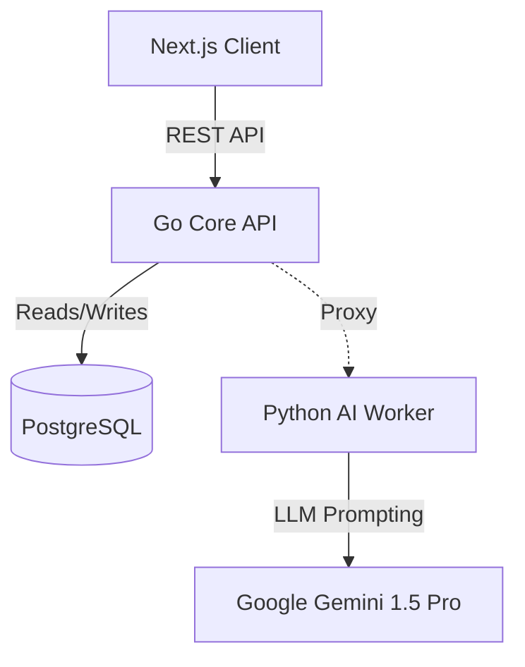

# System Architecture

CineFlow OS is built on a distributed monorepo strategy. By separating concerns across three highly specialized technology stacks, the system ensures resilience, zero blocking, and absolute scalability.

## High-Level Topology

## 1. The Core Orchestrator (Go / Chi / pgx)
**Location:** `/core-api`

The Go service is the absolute source of truth for the application. It acts as the gatekeeper to the database and the orchestrator of all heavy I/O operations.
- **Concurrency:** Uses Goroutines to handle massive asynchronous workloads, such as the WhatsApp Distribution Engine, firing off hundreds of messages without blocking HTTP responses.
- **Database Pooling:** Utilizes `pgxpool` for highly efficient, concurrent database connections.
- **Auto-Migrations:** On startup, `cmd/main.go` executes `internal/database/schema.go`, guaranteeing that the PostgreSQL schema and triggers are always strictly synced with the application logic.

## 2. The AI Worker (Python / FastAPI)
**Location:** `/ai-worker`

Python was chosen explicitly for this microservice because the AI/ML ecosystem is built around it. 
- **Isolation:** By isolating the PDF parsing and LLM communication in a separate FastAPI service, the Core Go API is completely protected from slow, long-polling AI tasks.
- **Data Engineering:** Uses PyMuPDF to extract raw text from screenplays, constructs structured prompts, and utilizes `google-generativeai` to force a strict JSON schema output representing Scenes and Breakdown Elements.

## 3. The Client (Next.js / React / Tailwind)
**Location:** `/client`

The frontend leverages Next.js 14 App Router for Server-Side Rendering (SSR) where possible, falling back to dynamic client components for rich interactivity.
- **Optimistic UI:** Used extensively in the Schedule Board (drag and drop) and Budget Tracker. The UI updates instantly, while syncing the data to the Go backend silently.
- **Tactile Aesthetics:** Styled entirely with utility-first Tailwind CSS. No generic component libraries are used, ensuring a bespoke, high-contrast, professional "Operating System" feel.

## 4. The Truth Layer (PostgreSQL)
A highly relational database schema enforcing strict referential integrity.

### Schema Hierarchy
- `projects`: The root entity.
- `scenes`: Script extractions mapping back to the project.
- `breakdown_elements`: Assets (Cast, Props, VFX) extracted by the AI.
- `scene_elements`: Many-to-many join table bridging Scenes and Breakdown Elements.
- `scheduled_scenes`: Assigns a specific `scene_id` to a shoot day and board order.
- `takes`: The Continuity Log ledger, bound by a unique constraint `(scene_id, take_number)`.
- `system_audit_logs`: The immutable ledger.

### Postgres Triggers
We utilize native PL/pgSQL functions (e.g., `audit_financials_func`) attached via triggers (`AFTER UPDATE`) to the `breakdown_elements` table. This enforces system hardening at the lowest possible layer, guaranteeing that no rogue API call or direct database manipulation can bypass the audit trail.
